<picture>
  <source media="(prefers-color-scheme: dark)" srcset="assets/hero-dark.svg">
  <source media="(prefers-color-scheme: light)" srcset="assets/hero-light.svg">
  
</picture>

  <b><a href="https://skanda-software.com">Skanda</a></b> &nbsp;·&nbsp;
  <a href="https://relincho.vercel.app">Relincho (demo)</a> &nbsp;·&nbsp;
  <a href="https://www.linkedin.com/in/nicol%C3%A1s-p%C3%A9rez-mart%C3%ADn-5773b0355/">LinkedIn</a>

**TL;DR** · Software engineering student (University of Seville, 2027) and co-founder of Skanda, a B2B SaaS for catering cost control, Santander X Award 2026 finalist. Looking for a first junior role in software or applied-AI research.

<picture>
  <source media="(prefers-color-scheme: dark)" srcset="assets/stack-dark.svg">
  <source media="(prefers-color-scheme: light)" srcset="assets/stack-light.svg">
  
</picture>

### Ahora mismo

Fui camarero en caterings, vi el problema desde dentro y monté **[Skanda](https://skanda-software.com)**. Estudio Ingeniería del Software en la Universidad de Sevilla (hasta 2027) y hago el TFG sobre seguridad en MCP. Busco mi primer puesto junior en IT o en un equipo de investigación en IA aplicada.

### Elaboración

<picture>
  <source media="(prefers-color-scheme: dark)" srcset="assets/flow-dark.svg">
  <source media="(prefers-color-scheme: light)" srcset="assets/flow-light.svg">
  
</picture>

1. **[Skanda](https://skanda-software.com)**: costes y eventos para catering. Escandallos y márgenes reales en tiempo real; una IA extrae los datos de las facturas de proveedores. Finalista del Santander X Award 2026. Código privado. 
   Next.js 16 · React 19 · TypeScript · Tailwind 4 + shadcn/ui · Clerk · Prisma · PostgreSQL (Supabase) · Stripe · Gemini

2. **[Relincho](https://github.com/nicopm0905/relincho)** · [demo](https://relincho.vercel.app): gestión multi-tenant de yeguadas de caballo PRE en Andalucía: sanidad, reproducción, alimentación, portal del propietario e IA. Factura con Veri\*Factu, con la huella encadenada validada contra los vectores oficiales de la AEAT. Objetivo: lanzarlo en SICAB 2026. 
   Next.js · TypeScript · tRPC v11 · Prisma · PostgreSQL con RLS (Supabase EU) · Auth.js v5 · Stripe · Cloudflare R2 · Resend · next-intl

3. **[Plataforma scout](https://github.com/nicopm0905/scouts)**: nace en mi propio grupo, el Grupo Scout San José de Jerez. Miembros, tesorería, actas, inventario y portal de familias con permisos por parentesco. El calendario valida las ratios legales de campamento (Decretos 45/2000 y 89/2018). 185 tests en Pest. 
   Laravel 11 · PHP 8.3 · PostgreSQL · Vue 3 + Inertia · Tailwind · spatie/permission · Pest · Docker · Google Drive API

4. **[Vision Transformers desde cero](https://github.com/nicopm0905/vision-transformers-mnist)**: 3 arquitecturas ViT entrenadas desde cero sobre MNIST, con validación cruzada de 5 folds. La mejor (patch 7, 6 capas): F1-macro medio de 0,9758 y 97,86 % en test. [Informe técnico](https://github.com/nicopm0905/vision-transformers-mnist/blob/main/docs/memoria.pdf). 
   Python · PyTorch · Hugging Face Transformers

<b>Fuera de carta</b> · EndOfLine, GitMiner, cerebro y el TFG

 

- **[EndOfLine](https://github.com/nicopm0905/EndOfLine)**: juego de mesa online de estrategia, en equipo, para Diseño y Pruebas (US, 2025/26). Modos Versus, Battle Royale, Puzzle Solitario y Cooperativo. Spring Boot 3 (Java 21) · React · Spring Security + JWT · JUnit 5 + Mockito
- **[GitMiner](https://github.com/nicopm0905/GitMiner)**: API REST que extrae y normaliza proyectos, commits, issues y usuarios de GitHub y Bitbucket (AISS 2025). Java · Spring Boot
- **cerebro** (privado): mi orquestador para Claude Code. Memoria en capas sobre un vault de Obsidian, servidor MCP propio, hooks como guardarraíles, evals y subagentes.
- **TFG** (en curso): seguridad en MCP (Model Context Protocol).

### Coste y margen

| Coste | Margen |
| :-- | :-- |
| Ingeniería Informática del Software, US · 2023–2027 | Finalista del Santander X Award 2026, con Skanda |
| Título profesional de violonchelo, Conservatorio Joaquín Villatoro · 2012–2023 | Claude Code in Action, Anthropic · agosto&nbsp;de&nbsp;2026 |
| Sala en caterings: Alda y Terry, Terralda, González Byas | MF0950 Construcción de Páginas Web · 60&nbsp;h · abril de 2025 |
| Español nativo · francés básico | Inglés B2, Cambridge English |

<a href="https://github.com/nicopm0905?tab=repositories">
<picture>
  <source media="(prefers-color-scheme: dark)" srcset="assets/pase-dark.svg">
  <source media="(prefers-color-scheme: light)" srcset="assets/pase-light.svg">
  
</picture>
</a>

---

[LinkedIn](https://www.linkedin.com/in/nicol%C3%A1s-p%C3%A9rez-mart%C3%ADn-5773b0355/) · [skanda-software.com](https://skanda-software.com) · Sevilla / Jerez de la Frontera
<!-- Email: añadir solo cuando Nico lo confirme. Formato: · [email](mailto:DIRECCION) -->
